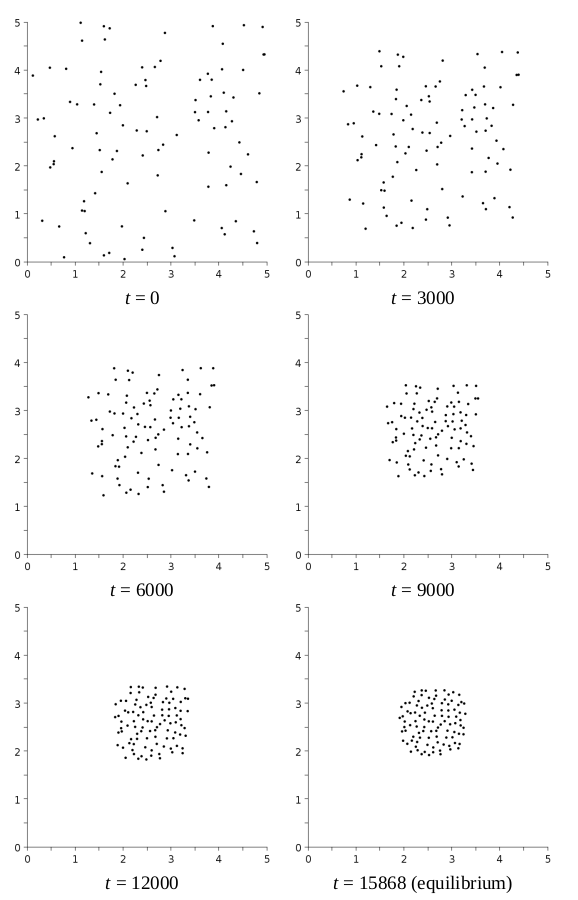

# **Overview**

A sequential and parallel program have been written in [openMP](http://www.omp4j.org/) for java.

# **N-body problem**

so-called N-body problems pop up now and then when studying natural phenomena. The behavior of atoms in a molecule, flocks of birds, schools of fish, insect swarms, and stars in a star cluster or galaxy can be modeled as N-body problems and computed with N-body programs.An N-body program where the bodies literally are corpses, or more precisely, zombies. I could have based this example on birds or stars, but zombies are cooler. Initially, N zombies are scattered at random locations within a certain area; this is the initial state. The zombies want to get together, so they all start moving towards each other. However, the zombies don’t want to be too close to one another. Each zombie continues moving until its attraction to the other zombies is exactly counterbalanced by its repulsion from nearby zombies. Thereafter, the zombies stay put; this is the equilibrium state. I want to write a program that, given the zombies’ initial state and certain other parameters, computes the zombies’ positions as a function of time. The zombies are indexed from 0 to N – 1. The zombies move in a two-dimensional plane. At any given instant in time, zombie i’s position is (x_i , y_i ). Consider just two zombies at indexes i and j. The distance between zombie i and zombie j is the Euclidean distance:

Bellow I am attaching snapshots of the zombies after certain intervals.

# **Program Input Output**

The program's command line arguments are as follows:
* seed - Seed for a pseudorandom number generator for initializing the zombies’ positions
* N - Number of zombies
* W - Size of the initial region in which to place the zombies
* G - Attraction factor used in equation (12.2)
* L - Attraction length scale used in equation (12.2)
* dt - Time step size
* eps - Convergence threshold ε
* steps - Number of time steps (0 means iterate until convergence)
* snap - Snapshot interval (0 means no snapshots)

**Example:**

$ javac ZombieSeq.java 
$ java ZombieSeq 142857 100 5 0.5 10 0.00001 0.001 0 3000 > sequential.out 

$ java -jar [path_openmp_jar] ZombieSmp 
$ java ZombieSmp 142857 100 5 0.5 10 0.00001 0.001 0 3000 > parallel.out 
