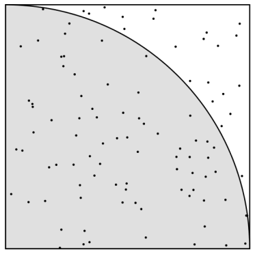

# **Overview**

A sequential and parallel program have been written in [openMP](http://www.omp4j.org/) for java.

# **Pi Estimation**

Imagine a square dartboard with sides of length 1 and with a
quadrant of a circle drawn in it. Suppose I throw a large number N of darts at the dartboard, and suppose C of them land inside the circle quadrant. Assuming the darts land at random positions, the ratio C/N should be approximately the same as the ratio of the circle quadrant’s area = π/4 to the dart-
board’s area = 1:

<h4> C/N ≈ π/4, or π ≈ 4C/N.</h4>

It would look something like this.

# **Program Input Output**

The program's command line arguments are the the seed for the pseudo random number generator(prng) and the number of darts to throw on the board and the program will output the calculation of

(4 * Number of darts that fall inside the circle quadrant) / (total number of darts thrown) ≈ pi

**Example:**

$ javac PiSeq.java 
$ java PiSeq 142857 12000000000 
pi = 4*9424753723/12000000000 = 3.141584574

$ java -jar [path_openmp_jar] PiSmp 
$ java PiSmp 142857 12000000000 
pi = 4*9424753723/12000000000 = 3.141584574
