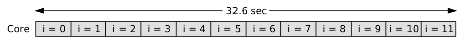
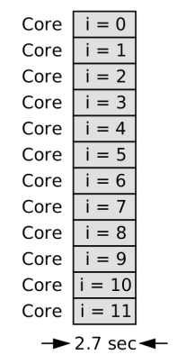

# **Overview**

A sequential and parallel program have been written in [openMP](http://www.omp4j.org/) for java.

# **Prime number checker**

In this exercise we will write a sequential program and a parallel program that tests numbers for primality. It prints the numbers on the command line that are prime.

# **Program Input Output**

$ java PrimeSeq 100000000000000003 100000000000000013 
100000000000000003 
100000000000000013

  * Runtime  
    

$ java PrimeSmp 100000000000000003 100000000000000013 
100000000000000003 
100000000000000013

  * Runtime  
    
